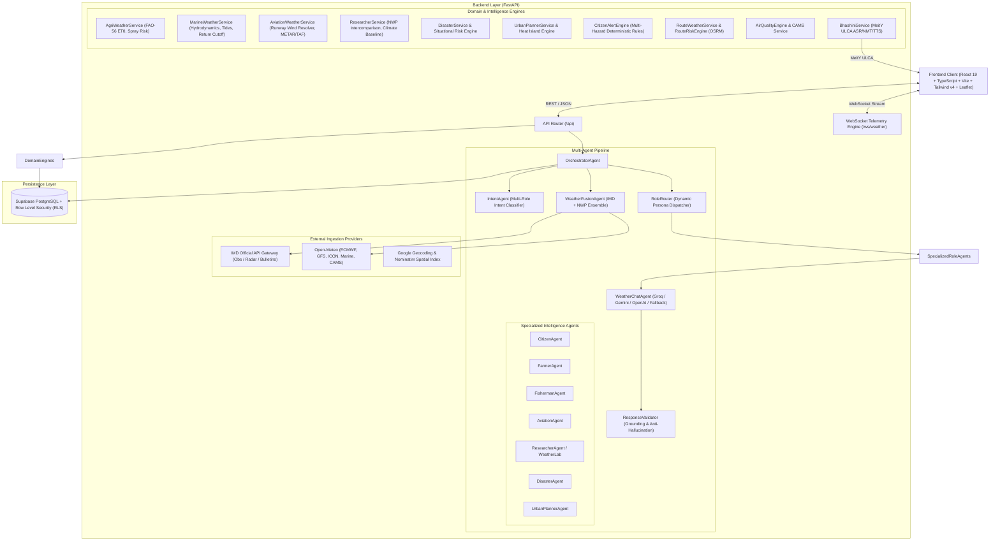

# WeatherGPT: Comprehensive Project Architecture & Status Analysis

**Problem Statement ID:** 26068  
**Title:** WeatherGPT: Conversational AI for Weather Forecasting, Alerts, and Climate Information  
**Organization:** Ministry of Earth Sciences (MoES) — India Meteorological Department (IMD)  
**Category:** Software | **Theme:** Disaster Management & Role-Aware Decision Intelligence  

---

## 1. Executive Summary & Problem Alignment

Weather information in India has traditionally been distributed through disparate bulletins, static portals, numerical model outputs, and fragmented advisories. This creates high cognitive friction for varied societal actors: everyday citizens, farmers, fishermen, aviation dispatchers, scientific researchers, emergency disaster managers, and municipal urban planners.

**WeatherGPT** resolves this challenge with an authoritative, conversational, multi-agent AI weather decision intelligence platform tailored specifically for Indian geography, critical economic sectors, and regional languages.

### Core Architecture Axiom:
> **"One Weather Dataset. One Geolocation. Different Decisions."**  
> WeatherGPT transforms raw NWP forecasts (temperature, rain, winds, humidity, pressure, CAPE) into tailored, deterministic operational advice matching the user's operational reality.

### Core Capabilities:
1. **Authoritative Meteorological Ingestion:** Direct client for India Meteorological Department (IMD) official alerts, radar observations, and bulletins alongside global Numerical Weather Prediction (NWP) model feeds (ECMWF, GFS, ICON, Open-Meteo).
2. **Deterministic Agentic Reasoning:** Grounded multi-agent pipeline enforcing zero LLM hallucination on physical values (temperatures, precipitation, runway bearings, wave heights, and flood risks).
3. **National Multilingual & Voice Stack:** MeitY **BHASHINI (National Language Translation Mission)** integration for ASR (Speech-to-Text), NMT (Machine Translation), and TTS (Text-to-Speech) in 11+ Indian languages.
4. **Role-Tailored Decision Engines:**
   - **🌾 Farmer (My Farm):** Spraying wash-off/drift risk, $\text{ET}_0$ soil moisture balance, hourly farming windows, and pest infection risks.
   - **🎣 Fisherman (My Sea):** Significant wave heights $H_s$, swell periods, safe sailing clearance, and return-time deterioration cutoff deadlines.
   - **✈️ Aviation (My Operations):** Magnetic runway crosswind/headwind trigonometry across $360^\circ$, ICAO METAR/TAF tokenized decoding, and VFR/MVFR/IFR/LVP categories.
   - **🔬 Researcher (WeatherLab):** Multi-model NWP intercomparison (GFS vs ECMWF vs IMD/WRF), 30-year climatological baseline anomalies (1991–2020), NetCDF/GRIB scientific datasets, and academic PDF/JSON report generation.
   - **🚨 Disaster Manager (Situational Intelligence):** Severe hazard triage, rainfall intensity, urban flood vulnerability, lightning tracking, and evacuation zone coordination.
   - **🌆 Urban Planner (Urban Weather Intelligence):** Microclimate heat islands, surface runoff/waterlogging propensity, drainage network load, and critical infrastructure exposure.
   - **👤 Citizen:** Daily umbrella necessity, thermal/UV comfort, commute safety, and AQI health advisories.
5. **Real-Time Live Event Telemetry:** WebSocket-powered bidirectional streaming (`/ws/weather`) for instantaneous storm, lightning, and marine warning broadcasts.

---

## 2. High-Level Architecture Overview



---

## 3. Implemented Role Intelligence Engines & Pages

### 3.1. 👤 Everyday Citizen
- **Purpose:** Daily living, commute, outdoor exercise, thermal comfort, umbrella necessity.
- **Frontend Pages:** `DashboardPage.tsx`, `AlertsPage.tsx`, `AirQualityPage.tsx`, `TravelPage.tsx`, `MapPage.tsx`.
- **Key Features:** Hyperlocal weather card, Dark/Light mode AQI split cards, multi-hazard alerts banner, OSRM route weather corridor, and interactive Doppler radar.

### 3.2. 🌾 Farmer (My Farm)
- **Purpose:** Agronomic decision support, chemical spraying windows, crop disease prevention.
- **Frontend Pages:** `FarmerDashboardPage.tsx`, `FarmerWeatherPage.tsx`, `FarmRoutePage.tsx`.
- **Key Components:**
  - `CropStageSelector.tsx`: Crop type (Soybean, Cotton, Wheat, Rice, Sugarcane, Groundnut) and phenological stage.
  - `FarmingWindowsTimeline.tsx`: Hourly suitability for Spraying, Irrigation, and Harvesting.
  - `SprayingRiskCard.tsx`: Wash-off vs. wind drift evaluation with Go / Caution / No-Go indicators.
  - `SoilMoistureGauge.tsx`: Root zone vs. surface moisture balance with FAO-56 $\text{ET}_0$ evapotranspiration.
  - `PestDiseaseRiskCard.tsx`: Fungal blight, rust, and pest infection risk models with IPM remedies.
  - `VernacularVoiceButton.tsx`: 1-tap Marathi / Hindi / English audio playback.

### 3.3. 🎣 Fisherman (My Sea)
- **Purpose:** Coastal and marine safety, hydrodynamic sea state, departure and return-time intelligence.
- **Frontend Pages:** `FisherDashboardPage.tsx`, `FishermanWeatherPage.tsx`, `FishFinderPage.tsx`.
- **Key Components:**
  - `SailingDecisionGauge.tsx`: Safe-to-Sail hero gauge (🟢 Favorable / 🟡 Caution / 🔴 No Departure).
  - `ReturnTimeTimeline.tsx`: Deterioration curve calculating exact return cutoff hour before dangerous sea conditions develop.
  - `SeaStateCard.tsx`: Significant Wave Height ($H_s$), Swell Period, Beaufort scale, and ocean currents.
  - `TideScheduleCard.tsx`: Semi-diurnal high/low tide predictions for Indian ports.
  - `ZoneRiskCard.tsx`: Near-shore ($0-5\text{ nm}$), Coastal ($5-20\text{ nm}$), Deep-Sea ($>20\text{ nm}$).
  - `MarineEmergencyCard.tsx`: Indian Coast Guard (1554), Marine Police (1093), VHF Ch 16.

### 3.4. ✈️ Aviation (My Operations)
- **Purpose:** Flight briefing, aerodrome conditions, crosswind limits, and ICAO METAR/TAF translation.
- **Frontend Pages:** `AviationDashboardPage.tsx`, `AviationWeatherPage.tsx`, `SkyRoutePage.tsx`.
- **Key Components:**
  - `AirportSelector.tsx`: Catalog of Indian international airports (VABB, VIDP, VOBL, VOMM, VAPO, VOHS, VECC, VOCI, VAAH, VOGO) with magnetic runway bearings.
  - `FlightCategoryBadge.tsx`: VFR, MVFR, IFR, and LVP classifications with ceiling and visibility.
  - `RunwayCrosswindDial.tsx`: Exact crosswind and headwind vector calculation:
    $$\text{Crosswind} = V_{\text{wind}} \cdot |\sin(\theta_{\text{wind}} - \theta_{\text{runway}})|$$
  - `ConversationalBriefingCard.tsx`: 3-hour structured briefing with "Period Requiring Attention".
  - `MetarTafDecoder.tsx`: Interactive tokenized ICAO string decoder with plain-English toggle.
  - `AirportComparisonModal.tsx`: Side-by-side landing comparison and enroute corridor analysis.

### 3.5. 🔬 Researcher (WeatherLab)
- **Purpose:** Multi-model NWP intercomparison, climatological anomaly tracking, open scientific datasets, and automated research reporting.
- **Frontend Pages:** `WeatherLabPage.tsx`.
- **Key Components:**
  - `NWPModelComparisonPanel.tsx`: Consensus analysis across GFS, ECMWF, IMD/WRF, and ICON.
  - `ForecastComparisonChart.tsx`: Hourly inter-model variance curves for temperature, precipitation, and wind.
  - `ClimateAnalyticsCard.tsx`: 30-year climatological baseline (1991–2020) temperature and rainfall anomalies.
  - `AvailableDatasetsCard.tsx`: Direct downloads for ERA5 Reanalysis, IMD Gridded Rainfall (0.25°), INSAT-3DR Satellite Imagery, and CAMS Air Quality NetCDF/GRIB datasets.
  - `ResearchReportModal.tsx` & `CreateReportCard.tsx`: Automated synthesis of structured academic reports with statistical confidence, methodology, and citations.
  - `ResearchAssistantModal.tsx`: Natural language meteorological query assistant strictly grounded in raw physical telemetry.

### 3.6. 🚨 Disaster Manager (Situational Weather Intelligence) - *In Implementation*
- **Visual Identity:** DARK BLUE (`#0A192F` / `#0F243E`) with AMBER/RED Warning Accents.
- **Core Focus:** Situational awareness, active alerts, extreme rainfall intensity, flood risks, lightning tracking, and vulnerable infrastructure zones.

### 3.7. 🌆 Urban Planner (Urban Weather Intelligence) - *In Implementation*
- **Visual Identity:** BLUE / SLATE (`#1E293B` / `#334155` / `#0F172A`).
- **Core Focus:** City infrastructure resilience, waterlogging/drainage bottleneck hotspots, microclimate urban heat island (UHI) indices, and precipitation peak timing.

---

## 4. Problem Statement Compliance Matrix (PS 26068)

| Key Feature / PS Requirement | Status | Implementation Details & Code References |
| :--- | :---: | :--- |
| **1. Real-time weather information retrieval** | ✅ **Complete** | Fused IMD observations + Open-Meteo NWP ensemble (ECMWF, GFS, ICON) in `open_meteo.py` & `fusion_agent.py`. |
| **2. Natural language conversational forecasts** | ✅ **Complete** | `OrchestratorAgent` + `IntentAgent` + `WeatherChatAgent` + `role_router.py`. |
| **3. Multi-Model NWP Integration** | ✅ **Complete** | GFS, ECMWF, IMD WRF/NCUM intercomparison and consensus rating in `researcher_service.py` & `WeatherLabPage.tsx`. |
| **4. Extreme weather alerts & early warning** | ✅ **Complete** | `CitizenAlertEngine.py` (7+ hazards), `EmergencyModeScreen.tsx`, and real-time WebSocket warning push. |
| **5. Location-based hyper-local advisories** | ✅ **Complete** | 5-tier coordinate resolver, district mapping, airport runaway azimuths, coastal harbor polygons. |
| **6. Multilingual support for Indian languages** | ✅ **Complete** | MeitY BHASHINI integration across 11 major Indian languages (`bhashini_service.py`). |
| **7. Climate trend & historical anomaly analysis** | ✅ **Complete** | 30-year climatological baseline (1991–2020) anomalies in `researcher_service.py` and `ClimatePage.tsx`. |
| **8. Vernacular Voice interaction** | ✅ **Complete** | BHASHINI ASR/TTS voice layer + browser Web Speech fallback in `useVoice.ts` and `VernacularVoiceButton.tsx`. |
| **9. Multi-Role Decision Intelligence** | ✅ **Complete** | Dedicated workflows for Citizen, Farmer, Fisherman, Aviation, Researcher, Disaster Manager, Urban Planner. |
| **10. Route Weather Intelligence** | ✅ **Complete** | Highway corridor analysis, Farm Route, Sky Route, Fish Finder, and departure time optimizer in `route_weather_service.py`. |

---

## 5. Technology Stack Summary

```
Frontend:
  ├── Framework: React 19 (TypeScript) + Vite 8
  ├── Styling: Tailwind CSS v4 + Lucide React Icons
  ├── Mapping / GIS: Leaflet + React-Leaflet + Doppler radar tile layers
  ├── Charts & Analytics: Recharts
  ├── Realtime: WebSocket client (useRealtimeWeather hook)
  └── PWA: Service Worker + Web App Manifest

Backend:
  ├── Framework: FastAPI (Python 3.11+) + Uvicorn + WebSockets
  ├── Multi-Agent Architecture: Orchestrator + Intent + Fusion + Role Router + Specialized Agents
  ├── LLM Grounding: Groq (LLaMA 3.3 70B), Gemini, OpenAI, Deterministic Fallbacks
  ├── Meteorological Ingestion: IMD API Gateway + Open-Meteo Ensemble (ECMWF / GFS / ICON / CAMS)
  ├── Multilingual & Voice: MeitY BHASHINI (ASR / NMT / TTS) + ISO-639-1 Engine
  ├── Routing & GIS: OSRM Road Engine + Harbors Geocoding + Aerodrome Runway Bearing Database
  └── Persistence: Supabase PostgreSQL with Row Level Security (RLS)
```

---

## 6. Directory Structure & Key Files

```
newWeatherGPT/
├── .agents/
│   ├── PROJECT_OVERVIEW.md             # Full architecture & problem statement documentation
│   ├── PROGRESS.md                     # Roadmap tracking & milestone progress logs
│   └── ROLE_BASED_INTELLIGENCE_PLAN.md # Deep decision models & role design specs
├── backend/
│   ├── app/
│   │   ├── agents/                     # Multi-agent architecture
│   │   │   ├── orchestrator_agent.py   # Primary orchestrator
│   │   │   ├── intent_agent.py         # Multi-role intent classification
│   │   │   ├── fusion_agent.py         # Meteorological fusion & confidence calculation
│   │   │   ├── role_router.py          # Dynamic role-based router
│   │   │   ├── citizen_agent.py        # Everyday citizen advisory generator
│   │   │   ├── farmer_agent.py         # Agricultural field-to-action agent
│   │   │   ├── fisherman_agent.py      # Marine hydrodynamics & safe-to-sail agent
│   │   │   ├── aviation_agent.py       # Aerodrome runway & METAR/TAF flight briefing agent
│   │   │   ├── research_agent.py       # WeatherLab scientific & NWP consensus agent
│   │   │   ├── disaster_agent.py       # Disaster management & situational risk agent
│   │   │   └── weather_chat_agent.py   # LLM grounding & prompt construction
│   │   ├── api/routes/                 # FastAPI REST & WebSocket endpoints
│   │   │   ├── roles.py                # Role intelligence APIs (farmer, fisher, aviation)
│   │   │   ├── researcher.py           # WeatherLab NWP, climate anomalies & reports
│   │   │   ├── websocket.py            # Real-time WebSocket streaming (/ws/weather)
│   │   │   ├── chat.py                 # Conversational chat endpoints
│   │   │   ├── alerts.py               # Multi-hazard alerts endpoints
│   │   │   └── bhashini.py             # MeitY translation & TTS
│   │   ├── services/                   # Domain decision engines
│   │   │   ├── agri_weather_service.py     # FAO-56 ET0, spray risk, farming windows
│   │   │   ├── marine_weather_service.py   # Wave physics, tides, return cutoff
│   │   │   ├── aviation_weather_service.py # Runway wind resolver, METAR decoder
│   │   │   ├── researcher_service.py       # NWP intercomparison, climate baseline
│   │   │   └── bhashini_service.py         # Vernacular speech & translation
│   │   └── schemas/                    # Strict Pydantic contracts
│   │       ├── role_intelligence.py    # Farmer, Fisher, Aviation schemas
│   │       └── researcher.py           # WeatherLab, NWP, and Report schemas
│   ├── main.py                         # Application entrypoint
│   └── requirements.txt                # Python dependencies
├── frontend/
│   ├── src/
│   │   ├── components/
│   │   │   ├── roles/                  # Role-specific UI widgets
│   │   │   │   ├── farmer/             # Farm timelines, spray meters, soil moisture
│   │   │   │   ├── fisher/             # Sailing gauges, return timelines, sea state
│   │   │   │   ├── aviation/           # Crosswind dials, METAR decoders, airport selectors
│   │   │   │   └── researcher/         # NWP comparison panels, dataset catalogs, report modals
│   │   │   ├── realtime/               # LiveEventPanel, RealtimeStatusIndicator
│   │   │   └── layout/                 # MobileAppShell, navigation
│   │   ├── pages/                      # Role master dashboards & specialized views
│   │   │   ├── DashboardPage.tsx       # Citizen home
│   │   │   ├── FarmerDashboardPage.tsx # Farmer decision center
│   │   │   ├── FisherDashboardPage.tsx # Fisherman decision center
│   │   │   ├── AviationDashboardPage.tsx # Aviation flight ops center
│   │   │   └── WeatherLabPage.tsx      # Researcher WeatherLab workspace
│   │   ├── services/                   # Frontend API clients
│   │   └── types/                      # TypeScript data contracts
│   └── package.json                    # Frontend dependencies
└── supabase_schema.sql                 # PostgreSQL database schema & RLS policies
```
