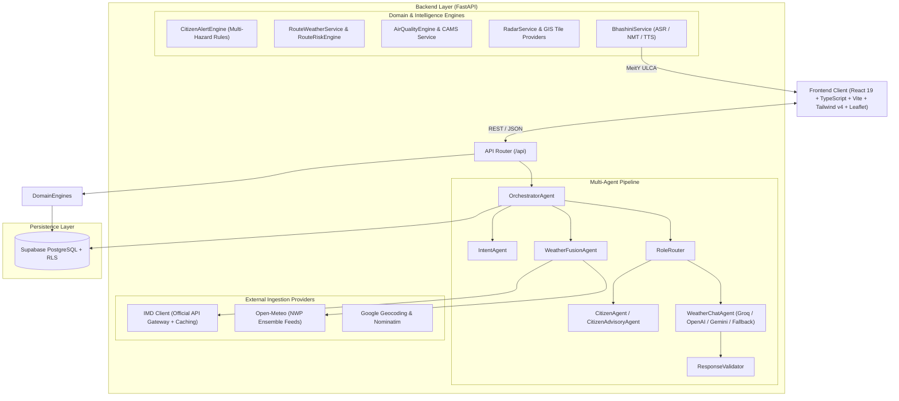

# WeatherGPT: Comprehensive Project Architecture & Status Analysis

**Problem Statement ID:** 26068  
**Title:** WeatherGPT: Conversational AI for Weather Forecasting, Alerts, and Climate Information  
**Organization:** Ministry of Earth Sciences (MoES) — India Meteorological Department (IMD)  
**Category:** Software | **Theme:** Disaster Management  

---

## 1. Executive Summary & Problem Alignment

Weather information in India has traditionally been distributed through multiple portals, bulletins, satellite products, and forecast systems, making it difficult for common citizens, farmers, fishermen, disaster responders, and municipal planners to obtain instant, actionable guidance.

**WeatherGPT** addresses this challenge by providing a unified, conversational, AI-driven weather intelligence platform tailored specifically for Indian geography, diverse societal roles, and Indian regional languages.

### Core Capabilities:
1. **Authoritative Meteorological Ingestion:** Direct client for India Meteorological Department (IMD) official alerts, observations, and diagnostics alongside global Numerical Weather Prediction (NWP) model feeds (ECMWF, GFS, Open-Meteo).
2. **Deterministic Agentic Reasoning:** Multi-agent pipeline with strict grounding to eliminate LLM hallucinations (temperatures, rainfall, or warnings are never fabricated).
3. **National Multilingual & Voice Stack:** Native integration with Government of India's **BHASHINI (National Language Translation Mission)** for ASR, NMT, and TTS in 11+ Indian languages.
4. **Spatial & Route Intelligence:** Highway corridor weather risk engine, departure time comparator, and interactive Leaflet GIS Doppler radar layers.
5. **Role-Tailored Decision Support:** Hyperlocal advisories tailored to everyday citizens, agricultural operations, marine/coastal safety, travel planning, and emergency disaster scenarios.

---

## 2. High-Level Architecture Overview



---

## 3. Features Implemented Till Now

### 3.1. Conversational AI & Multi-Agent Pipeline
- **`OrchestratorAgent`:** Coordinates the full pipeline: language discovery, session memory retrieval, location resolution, intent classification, weather intelligence fusion, role routing, and response validation.
- **`IntentAgent`:** Rule-based and semantic classifier supporting multiple intents:
  - `CURRENT_WEATHER`, `FORECAST`, `RAIN_INQUIRY`, `TEMPERATURE`, `AIR_QUALITY`
  - `ROUTE_WEATHER_ANALYSIS`, `DEPARTURE_TIME_COMPARISON`
  - `SEVERE_WEATHER_ALERT`, `GENERAL_WEATHER_ADVISORY`, `CLIMATE_ANALYSIS`
  - Relative location parsing ("near me", "here") and conversation context carry-over.
- **Strict Location Resolution (5-Tier Priority):**
  1. Explicit query override (e.g., *"weather in Shimla"*)
  2. GPS / Client-selected location
  3. Prior follow-up conversation entity
  4. User Profile saved coordinates in Supabase
  5. Interactive user prompt (Strictly forbids hardcoded Mumbai fallbacks).
- **Anti-Hallucination & Response Validation:**
  - LLM prompts are strictly constrained to pre-computed meteorological telemetry.
  - `ResponseValidator` checks temperatures and precipitation claims against raw model values.
  - Graceful degradation: Deterministic template generation if LLM APIs are unreachable.

### 3.2. Official IMD Integration & NWP Data Fusion
- **`IMDClient` & `IMDWeatherService`:** Production HTTP client with header authentication, rate-limiting, error categorization (`available`, `auth_error`, `rate_limited`, `timeout`), and caching.
- **`IMDLocationMapper`:** Maps coordinates to official IMD station IDs, sub-divisions, and districts.
- **`WeatherFusionAgent`:** Merges official IMD bulletin warnings with high-resolution NWP models (Open-Meteo ensemble: GFS/ECMWF), calculating an explainable **Confidence Score** and **Data Freshness** timestamp.

### 3.3. Multi-Hazard Early Warning & Alert Engine
- **`CitizenAlertEngine`:** Evaluates deterministic meteorological thresholds for 7+ hazards:
  - IMD Red / Orange / Yellow official alerts
  - Extreme rainfall (>15mm/h) & cloudburst indicators
  - Thunderstorm, lightning, and squalls
  - Heatwave & extreme heat indexes
  - Gale-force winds & high crosswinds
  - Dense fog & low visibility (<800m)
  - Flood risk & waterlogging propensity
- **Deduplication & Persistence:** Deterministic fingerprinting (`hashlib.sha256`) prevents notification fatigue. Stores alerts in Supabase `weather_alerts` table.
- **Emergency Mode:** High-contrast, streamlined emergency disaster response UI with direct helpline access and immediate safety guidelines.

### 3.4. Multilingual Support & BHASHINI Voice Layer
- **MeitY BHASHINI Integration:** Full pipeline configuration supporting ASR (speech-to-text), NMT (neural translation), and TTS (text-to-speech).
- **11 Supported Indian Languages:** English (`en`), Hindi (`hi`), Marathi (`mr`), Tamil (`ta`), Telugu (`te`), Kannada (`kn`), Malayalam (`ml`), Bengali (`bn`), Gujarati (`gu`), Punjabi (`pa`), Odia (`or`).
- **Dynamic Translation Layer:** Translates system responses, dashboard widgets, and alert advisories while preserving meteorological figures, units, and timestamps.
- **Voice Modal UI:** Voice recording, waveform animation, language toggle, and synthesized audio playback.

### 3.5. Weather-Aware Route Intelligence & Travel Planning
- **`RouteWeatherService` & `RouteRiskEngine`:**
  - Integrates OSRM highway routing geometry with spatial weather sampling.
  - Evaluates corridor hazard risk (severe, high, moderate, low).
  - **Departure Time Comparison:** Compares trip risks at different departure windows (e.g., 6:00 AM vs 9:00 AM vs 12:00 PM) to recommend the safest travel slot.
  - Travel alert preference subscriptions stored in Supabase.

### 3.6. Air Quality & Environmental Health Intelligence
- **`AirQualityEngine`:** Ingestion of CAMS / ECMWF atmospheric models via Open-Meteo.
- **Metrics Tracked:** European AQI, PM2.5, PM10, Nitrogen Dioxide ($\text{NO}_2$), Ozone ($\text{O}_3$), Sulphur Dioxide ($\text{SO}_2$), Carbon Monoxide ($\text{CO}$), and Dust.
- **Health Advisories:** Differentiated recommendations for general citizens, outdoor exercisers, and sensitive groups (asthma, elderly, children).

### 3.7. Interactive GIS Radar & Maps
- **Leaflet & React-Leaflet Map Suite:**
  - Precipitation radar layer with time-scrubbing animation controls.
  - Wind velocity vectors and atmospheric pressure overlays.
  - Temperature heatmaps and cloud cover density layers.
  - Active IMD Doppler radar station indicators.

### 3.8. Persona-Based User Management & Onboarding
- **Multi-Step Onboarding:** Welcome $\rightarrow$ Phone Auth $\rightarrow$ OTP verification $\rightarrow$ Username $\rightarrow$ Persona Role Selection $\rightarrow$ GPS Location Setup.
- **Role Framework (`RoleRouter`):**
  - **Citizen:** Live everyday advisories (umbrella necessity, commute safety, clothing, UV/thermal comfort).
  - **Farmer (Stub & UI):** Agronomic advice, sowing/harvesting conditions, irrigation scheduling.
  - **Fisherman (Stub & UI):** Marine sea-state, wave heights, coastal wind alerts.
  - **Disaster Manager / Urban Planner / Aviation (Stubs):** Severe hazard triage and infrastructure resilience.
- **Supabase Backend:** Complete PostgreSQL schema with Row-Level Security (RLS) for profiles, conversations, messages, alerts, and travel plans.

---

## 4. Problem Statement Compliance Matrix (PS 26068)

| Key Feature / PS Requirement | Implementation Status | Implementation Details & Codebase References |
| :--- | :---: | :--- |
| **1. Real-time weather information retrieval** | ✅ **Complete** | Ingests real-time temperature, humidity, wind, pressure, UV index, precipitation from fused IMD & NWP APIs. |
| **2. Natural language querying for weather forecasts** | ✅ **Complete** | `OrchestratorAgent` + `IntentAgent` + `WeatherChatAgent` support conversational forecasts, follow-ups, and relative queries. |
| **3. Integration with NWP models (GFS/WRF)** | ✅ **Complete** | Open-Meteo ensemble (GFS, ECMWF, ICON) integrated via `OpenMeteoProvider`; IMD model diagnostics via `IMDClient`. |
| **4. Extreme weather alerts & early warning** | ✅ **Complete** | `CitizenAlertEngine` with 7+ hazard categories, deterministic severity mapping, and dedicated `EmergencyModeScreen`. |
| **5. Location-based forecasting & advisories** | ✅ **Complete** | Hyperlocal GPS resolution, geocoding, IMD district mapping, and role-based advisory generators (`CitizenAgent`). |
| **6. Multilingual support for Indian languages** | ✅ **Complete** | National BHASHINI API integration supporting 11 major Indian languages across chat, alerts, and UI widgets. |
| **7. Climate trend & historical weather analysis** | 🟡 **Substantial** | `ClimatePage` & `ClimateAnalytics` components with historical trends, anomaly visualization, and `WhatIfSimulator`. |
| **8. Voice-enabled interaction for rural accessibility** | ✅ **Complete** | BHASHINI ASR/TTS voice layer + browser Web Speech API fallback + full voice modal interface. |
| **9. Mobile-based conversational AI platform** | ✅ **Complete** | Progressive Web App (PWA) shell with responsive layout, install prompts, service worker, and mobile app-like UI. |
| **10. Route Weather Intelligence & Decision Support** | ✅ **Complete** | Highway corridor analysis, multi-departure comparison, and travel risk alerts. |

---

## 5. Technology Stack Summary

```
Frontend:
  ├── Framework: React 19 (TypeScript) + Vite 8
  ├── Styling: Tailwind CSS v4 + Lucide React Icons
  ├── Mapping / GIS: Leaflet + React-Leaflet
  ├── Charts & Analytics: Recharts
  └── PWA: Service Worker + Web App Manifest

Backend:
  ├── Framework: FastAPI (Python 3.11+) + Uvicorn
  ├── Architecture: Multi-Agent Orchestration Pattern
  ├── LLM Engine: Groq (LLaMA 3.3 70B Versatile), OpenAI, Gemini, Deterministic Mock
  ├── Meteorological Ingestion: IMD API Gateway + Open-Meteo Ensemble (ECMWF/GFS/CAMS)
  ├── Multilingual & Voice: MeitY BHASHINI (ASR / NMT / TTS) + ISO-639-1 Engine
  ├── Routing & GIS: OSRM Road Engine + Spatial Coordinate Interpolator
  └── Database: Supabase PostgreSQL with Row Level Security (RLS)
```

---

## 6. Directory Structure & Key Files

```
newWeatherGPT/
├── .agents/
│   └── PROJECT_OVERVIEW.md         # Full project & problem statement context documentation
├── backend/
│   ├── app/
│   │   ├── agents/                 # Multi-agent architecture
│   │   │   ├── orchestrator_agent.py   # Primary orchestrator
│   │   │   ├── intent_agent.py         # Intent classification & entity extraction
│   │   │   ├── fusion_agent.py         # Meteorological fusion & confidence calculation
│   │   │   ├── citizen_agent.py        # Everyday citizen advisory generator
│   │   │   ├── citizen_advisory_agent.py # Rule-based advisory synthesis
│   │   │   ├── weather_chat_agent.py   # LLM grounding & prompt construction
│   │   │   └── role_router.py          # Dynamic role-based routing
│   │   ├── api/routes/             # FastAPI REST endpoints (chat, weather, alerts, radar, etc.)
│   │   ├── core/                   # Configuration, alert thresholds, errors, logging
│   │   ├── llm/                    # LLM providers (Groq, OpenAI, Gemini, Mock)
│   │   ├── providers/              # External weather, air quality, and geocoding providers
│   │   ├── schemas/                # Pydantic data contracts
│   │   └── services/               # Business logic (IMD, BHASHINI, route, air quality, radar)
│   ├── main.py                     # Entrypoint
│   └── requirements.txt            # Dependencies
├── frontend/
│   ├── src/
│   │   ├── components/             # UI widgets (chat, dashboard, map, radar, route, alerts, voice)
│   │   ├── pages/                  # Top-level views (Dashboard, Chat, Alerts, Map, Travel, AirQuality)
│   │   ├── services/               # API clients (chatService, weatherService, bhashiniService, etc.)
│   │   ├── context/                # React state providers (Auth, Weather, Location, Language, UI)
│   │   ├── types/                  # TypeScript interface definitions
│   │   └── App.tsx                 # Root router & shell
│   └── package.json                # Frontend dependencies
├── supabase_schema.sql             # Complete database schema & RLS definitions
└── .env.example                    # Environment configuration template
```

---

## 7. Recommended Next Steps for Complete Production Readiness

1. **Deepen Agronomic & Marine Logic for Stubs:**
   - Expand `farmer_agent.py` with crop growth stages (Kharif/Rabi), soil moisture deficit calculations, and pesticide spray advisories.
   - Expand `fisherman_agent.py` with INCOIS (Indian National Centre for Ocean Information Services) high wave alerts and potential fishing zone (PFZ) data.
2. **Direct WIS 2.0 / MQTT Streaming:**
   - Integrate World Meteorological Organization (WMO) WIS 2.0 / MQTT broker for instantaneous sub-second warning pushes.
3. **Advanced Offline & Low-Bandwidth Caching:**
   - Enable IndexedDB caching on the PWA frontend for offline viewing of last-synced forecasts in remote rural regions.
