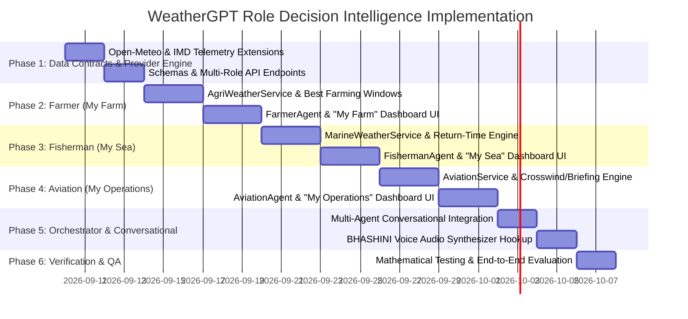

# WeatherGPT: The Role-Aware Weather Decision Intelligence Platform
## Architecture & Phase-Wise Implementation Plan for Farmer, Fisherman & Aviation

**Core Theme:** *"One Weather Event. Different Decisions."*  
**Problem Statement ID:** 26068 (Ministry of Earth Sciences — India Meteorological Department)  
**Target Roles:** 🌾 **Farmer (My Farm)** | 🎣 **Fisherman (My Sea)** | ✈️ **Aviation (My Operations)**  
**File Location:** `newWeatherGPT/.agents/ROLE_BASED_INTELLIGENCE_PLAN.md`

---

## 1. Strategic USP & Decision Intelligence Framework

IMD and meteorological agencies already provide sector-specific bulletins, GFS/WRF forecasts, and marine/agri advisories. **WeatherGPT does not claim to reinvent meteorological observations; its breakthrough differentiation is the conversational, personalized, cross -data Decision Layer that answers the core question: *"What should I do?"***

```
                              ┌─────────────────────────────────────────────────────────┐
                              │                    ONE WEATHER EVENT                    │
                              │           (e.g., Advancing Rain & High Winds)           │
                              └────────────────────────────┬────────────────────────────┘
                                                           │
             ┌─────────────────────────────────────────────┼─────────────────────────────────────────────┐
             │                                             │                                             │
             ▼                                             ▼                                             ▼
    🌾 FARMER (My Farm)                           🎣 FISHERMAN (My Sea)                        ✈️ AVIATION (My Operations)
    ──────────────────────────────                ──────────────────────────────               ────────────────────────────
    USP: Field-to-Action Crop Advisor             USP: Safe-to-Sail Decision Agent             USP: Conversational Flight Briefing
    "What should I do on my farm                  "Should I sail, where can I fish,            "Give me the weather risks that
     because of tomorrow's weather?"               and when should I return?"                   matter for this operation."
    ──────────────────────────────                ──────────────────────────────               ────────────────────────────
    • Best Farming Windows                        • Sail / No-Sail Decision Engine             • Structured Airport Briefing
      - Irrigation Window (e.g. 6-8 AM)             - 🟢 5:30-9 AM: Favorable                    (Visibility, Wind, CB, RVR)
      - Spraying Window (e.g. 7-10 AM)              - 🟠 9-12 PM: Wind Increasing              • Multi-Airport Condition Compare
      - Harvest Risk (High after 4 PM)              - 🔴 After 12 PM: Severe Sea                 (e.g. BOM vs PNQ next 2 hrs)
    • Chemical Spraying Risk                      • Return-Time Intelligence                   • Runway Crosswind & Headwind
      (Wash-off & Drift Evaluation)                 ("When must I turn back?")                   Exceedance Calculator
    • Crop & Stage Specific Advisories            • IMD & INCOIS Bulletin Fusion               • Plain-English METAR/TAF Decoder
    • 1-Tap Vernacular Voice Audio                • Vernacular Audio Marine Warning            • Period Requiring Attention Alerts
```

---

## 2. Signature Decision Workflows by Role

---

### 2.1. 🌾 FARMER: Field-to-Action Crop Advisor
> **Signature Pitch:** *"From weather forecast to farm action."*  
> **UI Dashboard:** `🌾 MY FARM` — *Weather for your crop*

#### A. Core Decision Questions Answered
1. **Chemical Spraying Decision:**
   - *Query:* *"I have soybean in my field. Should I spray pesticide tomorrow morning?"*
   - *Engine Reasoning:* Checks field geolocation $\rightarrow$ crop type & phenological stage $\rightarrow$ hourly rainfall intensity ($4\text{ h}$ post-application) $\rightarrow$ wind speed drift ($>15\text{ km/h}$) $\rightarrow$ surface temperature.
   - *Output:* 🔴 **Spraying Risk: HIGH**. Rain is expected 2–4 hours after application. Postpone to Friday 7:00 AM–10:00 AM.
2. **Best Farming Windows Engine:**
   - Evaluates the next 24–48 hours to compute exact time slots:
     - 💧 **Best Irrigation Window:** e.g., `06:00 AM – 08:30 AM` (low evaporation rate, zero rain forecast).
     - 🧪 **Best Spraying Window:** e.g., `07:00 AM – 10:00 AM` (wind $<12\text{ km/h}$, rain chance $<15\%$).
     - 🌾 **Harvesting Risk:** `High Risk after 04:00 PM` (advancing convective showers).
3. **Pest & Disease Infection Propensity:**
   - Temperature-humidity-leaf wetness index calculation for fungal blights, rust, and sucking pests.
4. **1-Tap Vernacular Voice Delivery:**
   - BHASHINI-powered regional audio advisory (Marathi, Hindi, Telugu, Kannada, Tamil, Punjabi) so farmers can listen without reading screens in bright sunlight.

#### B. `MY FARM` Dashboard Structure
- **Card 1: Field Weather & Soil State** (Temperature, rain probability, soil moisture $0-7\text{ cm}$ & $7-28\text{ cm}$, $\text{ET}_0$ evapotranspiration).
- **Card 2: Best Farming Windows** (Visual hourly timeline for Spraying, Irrigation, Sowing/Harvesting).
- **Card 3: Spraying & Fertilizer Suitability** (Real-time Go/No-Go badge with drift and wash-off risk breakdown).
- **Card 4: Crop & Pest Risk Alert** (Crop-specific vulnerability based on Kharif/Rabi calendars).
- **Card 5: 1-Tap Vernacular Audio Briefing** (🎙 Listen in Marathi/Hindi/Regional language).

---

### 2.2. 🎣 FISHERMAN: Safe-to-Sail Decision Agent
> **Signature Pitch:** *"Know when to sail, where the risk is, and when to return."*  
> **UI Dashboard:** `🎣 MY SEA` — *Weather for your fishing zone*

#### A. Core Decision Questions Answered
1. **The Sail / No-Sail Decision:**
   - *Query:* *"Should I take my boat out from Sassoon Docks tomorrow morning?"*
   - *Engine Reasoning:* Evaluates significant wave height ($H_s$), swell period, gust factors, squall/cyclone probability, and IMD/INCOIS coastal warning bulletins.
   - *Output:*
     - 🟢 **05:30 AM – 09:00 AM:** Comparatively favorable ($H_s < 1.2\text{m}$, Wind $10-14\text{ kts}$).
     - 🟠 **09:00 AM – 12:00 PM:** Increasing wind ($18-24\text{ kts}$) & wave chop ($1.8\text{m}$).
     - 🔴 **After 12:00 PM:** Severe marine conditions ($H_s > 2.8\text{m}$, squall risk). **Avoid remaining offshore into the afternoon.**
2. **Return-Time Intelligence (Killer Feature):**
   - *Query:* *"If I sail at 5:00 AM, when must I return to harbor?"*
   - *Engine Reasoning:* Analyzes forecast deterioration curve along the return vector.
   - *Output:* **Recommended Return Time: Before 10:30 AM.** Sea conditions deteriorate sharply by 12:00 PM.
3. **Zone-Tiered Risk & Tide Predictions:**
   - Near-shore ($0-5\text{ nm}$), Coastal ($5-20\text{ nm}$), Deep-Sea ($>20\text{ nm}$).
   - High tide and Low tide peak hours and amplitude heights.
4. **Emergency Marine Broadcast & Vernacular Audio:**
   - 1-tap audio warnings in coastal languages (Tamil, Telugu, Malayalam, Marathi, Bengali, Odia, Gujarati) + Coast Guard SOS (1554).

#### B. `MY SEA` Dashboard Structure
- **Card 1: Sail / No-Sail Decision Gauge** (🟢 Favorable / 🟡 Caution Near-Shore / 🔴 No Departure).
- **Card 2: Return-Time Intelligence Timeline** (Departure time $\rightarrow$ Safe Fishing Window $\rightarrow$ Return Deadline).
- **Card 3: Sea Conditions & Swell Radar** (Wave Height $H_s$, Swell Period, Direction, Sea Surface Temp).
- **Card 4: Coastal Wind & Gust Dynamics** (Knots, Beaufort Scale level, Squall probability).
- **Card 5: Tide Schedule & Marine Alerts** (High/Low tide times + IMD/INCOIS official bulletins + SOS).

---

### 2.3. ✈️ AVIATION: Conversational Flight Weather Briefing
> **Signature Pitch:** *"Complex aviation weather, one conversational briefing."*  
> **UI Dashboard:** `✈️ MY OPERATIONS` — *Weather for aviation decisions*

#### A. Core Decision Questions Answered
1. **Conversational Airport Weather Briefing:**
   - *Query:* *"Give me a weather briefing for Mumbai airport (VABB) for the next 3 hours."*
   - *Engine Reasoning:* Decodes METAR/TAF, parses cloud base/ceiling, visibility, runway winds, convective thunderstorm likelihood, and temperature/dewpoint spread.
   - *Output Structure:*
     - ✈️ **Mumbai (VABB) Aviation Weather Briefing**
     - **Flight Rules:** VFR (Ceiling 4,500 ft, Visibility 6,000m)
     - **Wind & Runway:** Runway 27 active — Wind 260° at 14 kts. Headwind: 13.8 kts, Crosswind: 2.4 kts (Within safe limits).
     - **Thunderstorm / CB Risk:** Low next 2 hours; Isolated CB development possible post-16:00 IST.
     - **Period Requiring Attention:** 16:30 – 18:30 IST (Gust spread up to 24 kts).
2. **Multi-Airport Conditions Comparison:**
   - *Query:* *"Compare Mumbai (VABB) and Pune (VAPO) conditions for the next 2 hours."*
   - *Output:* Side-by-side comparative briefing on ceiling, crosswind, and landing suitability.
3. **Runway Crosswind & Headwind Vector Resolver:**
   - Trigonometric computation using exact magnetic runway azimuths for Indian airports:
     $$\text{Crosswind} = V_{\text{wind}} \times |\sin(\theta_{\text{wind}} - \theta_{\text{runway}})|$$
     $$\text{Headwind} = V_{\text{wind}} \times \cos(\theta_{\text{wind}} - \theta_{\text{runway}})$$
   - Alerts if crosswinds exceed narrowbody/turboprop operational limits ($>15\text{ kts}$ / $>25\text{ kts}$).
4. **Plain-English METAR/TAF Decoder:**
   - Toggleable interactive card translating raw ICAO strings into plain language with color-coded token highlights.

#### B. `MY OPERATIONS` Dashboard Structure
- **Card 1: Airport Selector & Flight Category Badge** (ICAO/IATA selector + VFR/MVFR/IFR/LVP status).
- **Card 2: 3-Hour Conversational Briefing Box** (Structured executive briefing with "Period Requiring Attention").
- **Card 3: Runway Crosswind Visualizer** (Runway orientation dial with aircraft compass and wind vector arrows).
- **Card 4: Cloud Ceiling, Visibility & RVR** (Cloud base height in ft AGL, lowest layer coverage, visibility).
- **Card 5: Interactive METAR / TAF Decoder** (Raw ICAO code with plain-English toggle and hazard highlights).

---

## 3. Phase-Wise Implementation Roadmap



---

### Phase 1: Architectural Foundation & Unified Data Contracts (🟢 COMPLETED)

1. **Extend External Provider Ingestion:**
   - **`backend/app/providers/weather/open_meteo.py`:** Added agricultural variables (`soil_moisture_0_to_7cm`, `soil_moisture_7_to_28cm`, `et0_fao_evapotranspiration`, `soil_temperature_0cm`, `vapour_pressure_deficit`), aviation variables (`cloud_cover_low/mid/high`, `visibility`, `surface_pressure`, `dew_point_2m`, `wind_gusts_10m`, `cape`), and marine hydrodynamic method (`fetch_marine_weather`). ✅
2. **Define Strict Pydantic Data Contracts:**
   - **`backend/app/schemas/role_intelligence.py`:**
     - `FarmerDecisionData` (Soil state, farming windows, spray risk, disease propensity). ✅
     - `MarineDecisionData` (Sailing clearance, temporal risk curve, return deadline, tide peaks). ✅
     - `AviationDecisionData` (Runway crosswinds, flight rules, conversational brief, period requiring attention). ✅
3. **Create REST API Endpoints:**
   - **`backend/app/api/routes/roles.py`:**
     - `GET /api/roles/farmer/decisions?lat=...&lon=...&crop=...&stage=...` ✅
     - `GET /api/roles/fisher/decisions?lat=...&lon=...&departure_time=...` ✅
     - `GET /api/roles/aviation/briefing?icao=...&runway=...` ✅
     - `GET /api/roles/aviation/compare?icao1=...&icao2=...` ✅
     - `GET /api/roles/airports` ✅
4. **Verification & Wiring:**
   - Registered in **`backend/app/api/routes/router.py`** and verified via **`backend/tests/test_roles_phase1.py`**. ✅


---

### Phase 2: 🌾 Farmer Intelligence Engine & "My Farm" Dashboard (Days 5–10)

1. **Backend Decision Engine:**
   - **`backend/app/services/agri_weather_service.py`:**
     - `calculate_farming_windows(forecast)`: Computes best irrigation, spraying, and harvest slots.
     - `evaluate_spraying_risk(crop, stage, forecast, planned_time)`: Wash-off & drift calculation.
     - `calculate_disease_propensity(crop, temp_series, humidity_series)`: Pest/fungal risk index.
2. **Full Agent Implementation:**
   - **`backend/app/agents/farmer_agent.py`:**
     - Replaces stub with full `RoleAgent` generating grounded advice and conversational responses.
3. **Frontend `MY FARM` Dashboard & Components:**
   - **`frontend/src/pages/FarmerDashboardPage.tsx`**
   - **`frontend/src/components/roles/farmer/FarmingWindowsTimeline.tsx`** (Hourly colored slots).
   - **`frontend/src/components/roles/farmer/SprayingRiskCard.tsx`** (Wash-off & drift risk).
   - **`frontend/src/components/roles/farmer/SoilMoistureGauge.tsx`** (Surface vs Root zone).
   - **`frontend/src/components/roles/farmer/CropStageSelector.tsx`** (Cotton, Soybean, Wheat, Rice).
   - **`frontend/src/components/roles/farmer/VernacularVoiceButton.tsx`** (1-tap BHASHINI TTS).

---

### Phase 3: 🎣 Marine Intelligence Engine & "My Sea" Dashboard (Days 11–16)

1. **Backend Hydrodynamic & Return-Time Engine:**
   - **`backend/app/services/marine_weather_service.py`:**
     - `evaluate_sailing_clearance(marine_data, imd_warnings)`: Computes Go / Caution / No-Sail status.
     - `calculate_return_time(departure_time, forecast_hourly)`: Identifies exact deterioration cutoff hour.
     - `compute_tide_extrema(coordinates, date)`: High/low tide calculation.
2. **Full Agent Implementation:**
   - **`backend/app/agents/fisherman_agent.py`:**
     - Conversational decision support for marine departure, zone danger, and return timing.
3. **Frontend `MY SEA` Dashboard & Components:**
   - **`frontend/src/pages/FisherDashboardPage.tsx`**
   - **`frontend/src/components/roles/fisher/SailingDecisionGauge.tsx`** (🟢/🟡/🔴 Hero Indicator).
   - **`frontend/src/components/roles/fisher/ReturnTimeTimeline.tsx`** (Departure $\rightarrow$ Fishing $\rightarrow$ Return cutoff).
   - **`frontend/src/components/roles/fisher/SeaStateCard.tsx`** (Wave height, swell period, sea temp).
   - **`frontend/src/components/roles/fisher/TideScheduleCard.tsx`** (Tide curve & high/low markers).
   - **`frontend/src/components/roles/fisher/MarineEmergencyCard.tsx`** (Coast Guard SOS dialer).

---

### Phase 4: ✈️ Aviation Meteorological Engine & "My Operations" Dashboard (Days 17–22)

1. **Backend Aviation Briefing Engine:**
   - **`backend/app/services/aviation_weather_service.py`:**
     - `resolve_runway_winds(runway_heading, wind_speed, wind_dir)`: Computes crosswind & headwind components with exceedance flags.
     - `generate_aviation_briefing(icao, weather_data)`: Generates structured 3-hour flight brief with "Period Requiring Attention".
     - `decode_metar_taf(raw_string)`: Plain-English parser with tokenized explanation.
     - `compare_airports(icao1, icao2)`: Side-by-side airport weather comparison.
2. **Full Agent Implementation:**
   - **`backend/app/agents/aviation_agent.py`:**
     - Conversational aviation assistant generating pilot and dispatcher briefing notes.
3. **Frontend `MY OPERATIONS` Dashboard & Components:**
   - **`frontend/src/pages/AviationDashboardPage.tsx`**
   - **`frontend/src/components/roles/aviation/AirportSelector.tsx`** (Major Indian airports catalog: BOM, DEL, BLR, MAA, PNQ, HYD, CCU, COK).
   - **`frontend/src/components/roles/aviation/RunwayCrosswindDial.tsx`** (Interactive compass dial).
   - **`frontend/src/components/roles/aviation/ConversationalBriefingCard.tsx`** (Executive brief).
   - **`frontend/src/components/roles/aviation/MetarTafDecoder.tsx`** (Tokenized interactive decoder).
   - **`frontend/src/components/roles/aviation/AirportComparisonModal.tsx`** (Dual airport comparator).

---

### Phase 5: Multi-Agent Orchestration & Conversational Binding (Days 23–26)

1. **Wire Role Agents into Central Pipeline:**
   - Update **`backend/app/agents/role_router.py`** to route user persona queries directly to `FarmerAgent`, `FishermanAgent`, or `AviationAgent`.
   - Update **`backend/app/agents/intent_agent.py`** to classify role-specific queries (*"Should I spray?"*, *"When must I return to harbor?"*, *"Briefing for Delhi airport"*).
2. **BHASHINI Vernacular Audio Pipelines:**
   - Connect role advisory outputs to BHASHINI TTS for regional audio delivery (Marathi for Vidarbha/Marathwada farmers, Tamil/Telugu for Coromandel fishermen, Hindi for Northern plains).

---

### Phase 6: Verification, Mathematical Testing & QA (Days 27–30)

1. **Automated Mathematical Tests:**
   - Verify FAO-56 $\text{ET}_0$ and spray window calculations across varying humidity/wind profiles.
   - Verify wave height classification boundaries ($<1.0\text{m}$, $1.0-2.0\text{m}$, $>2.8\text{m}$).
   - Verify crosswind trigonometry across all $360^\circ$ angles against standard aviation flight computer results.
   - Verify that one single weather dataset produces 3 distinct, tailored decision outputs across Farmer, Fisherman, and Aviation personas.
2. **User Experience & PWA Responsive Testing:**
   - Outdoor visibility testing (high-contrast cards for farmer/fisherman mobile screens).
   - Touch targets and 1-tap voice audio playback.

---

## 4. Summary of Files to be Created or Modified

| Component | File Path | Action | Description |
| :--- | :--- | :---: | :--- |
| **Data Contracts** | `backend/app/schemas/role_intelligence.py` | `[NEW]` | Pydantic contracts for Farmer, Fisher & Aviation decisions. |
| **Provider** | `backend/app/providers/weather/open_meteo.py` | `[MODIFY]` | Add Agri, Marine, and Aviation telemetry parameters. |
| **API Route** | `backend/app/api/routes/roles.py` | `[NEW]` | REST endpoints for role decision intelligence. |
| **Agri Service** | `backend/app/services/agri_weather_service.py` | `[NEW]` | Best farming windows, spray risk, and crop disease calculations. |
| **Farmer Agent** | `backend/app/agents/farmer_agent.py` | `[MODIFY]` | Upgrade stub to full conversational `FarmerAgent`. |
| **Marine Service** | `backend/app/services/marine_weather_service.py` | `[NEW]` | Sailing clearance, return-time engine, and tide predictions. |
| **Fisher Agent** | `backend/app/agents/fisherman_agent.py` | `[MODIFY]` | Upgrade stub to full conversational `FishermanAgent`. |
| **Aviation Service**| `backend/app/services/aviation_weather_service.py`| `[NEW]` | Runway crosswind resolver, METAR decoder, and flight brief. |
| **Aviation Agent** | `backend/app/agents/aviation_agent.py` | `[NEW]` | Conversational aviation briefing agent. |
| **Role Router** | `backend/app/agents/role_router.py` | `[MODIFY]` | Register active domain agents in the router. |
| **Frontend Farmer**| `frontend/src/pages/FarmerDashboardPage.tsx` | `[NEW]` | `MY FARM` dedicated decision dashboard. |
| **Frontend Fisher**| `frontend/src/pages/FisherDashboardPage.tsx` | `[NEW]` | `MY SEA` dedicated decision dashboard. |
| **Frontend Aviation**| `frontend/src/pages/AviationDashboardPage.tsx`| `[NEW]` | `MY OPERATIONS` dedicated aviation briefing dashboard. |
| **Frontend Router**| `frontend/src/App.tsx` | `[MODIFY]` | Route persona selections to dedicated role dashboards. |

---

## 5. Execution Readiness & Next Step

The architecture and plan are fully aligned with the **Decision Intelligence USP ("One weather event. Different decisions.")** for **Farmer**, **Fisherman**, and **Aviation**.

When approved, we will begin with **Phase 1 (Data Contracts & Provider Extensions)**.
